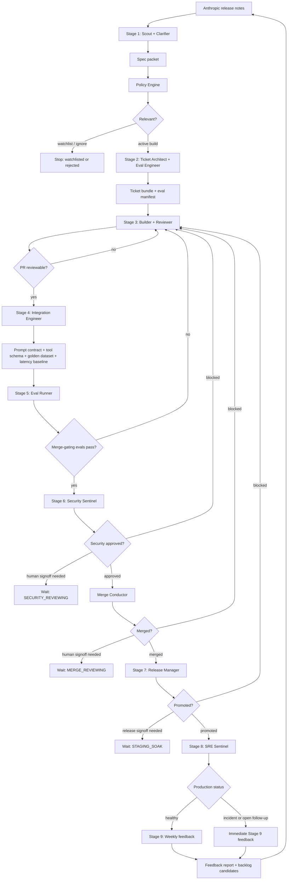
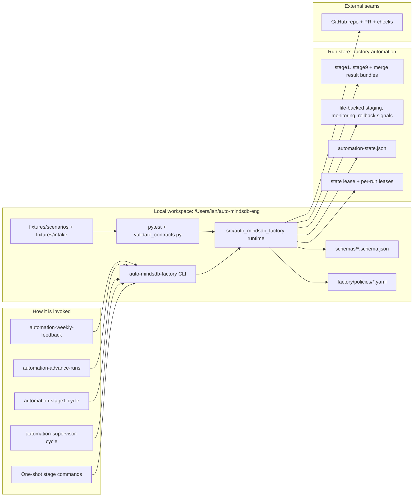

# AI Factory Architecture

This is the current executable shape of the factory: Anthropic release-note intake, policy assignment, staged build/review/eval/security/merge/release/monitoring/feedback, recurring automation around a persisted run store, and a first real vertical slice that creates GitHub PR evidence while keeping deployment and observability file-backed.

## Workflow

## Runtime

## Execution Surfaces

- One-shot stages run through `uv run auto-mindsdb-factory stage1-intake`, `stage2-ticketing`, `stage3-build-review`, `stage4-integration`, `stage5-eval`, `stage6-security-review`, `stage-merge`, `stage7-release-staging`, `stage8-production-monitoring`, and `stage9-feedback-synthesis`.
- The autonomous lane runs through `uv run auto-mindsdb-factory automation-supervisor-cycle --store-dir .factory-automation ...`.
- Persisted work lives in `.factory-automation`, with stage result bundles per work item and shared automation state in `automation-state.json`.
- The first real vertical slice runs through `uv run auto-mindsdb-factory factory-vertical-slice --store-dir .factory-automation --repository ianu82/ai-factory`.
- GitHub is the first real connector seam: the slice creates a branch, commits a small evidence file, opens a draft PR, and records PR/check status in the run store.
- Staging, monitoring, and rollback use JSON signal files in `.factory-automation/ops-signals/<work_item_id>/` until real deploy, observability, feature-flag, and rollback providers replace them.
- Operators can inspect the local control-plane view with `uv run auto-mindsdb-factory factory-cockpit --store-dir .factory-automation`.
- Governance lives in `factory/policies/*.yaml`; handoff shape and drift checks live in `schemas/*.schema.json` and `scripts/validate_contracts.py`.
- The current boundary is live rollback execution. Stage 8 can model mitigation and escalation, Stage 9 can synthesize incident feedback, and the vertical slice can require rollback-probe evidence, but no real infrastructure rollback command is executed yet.
