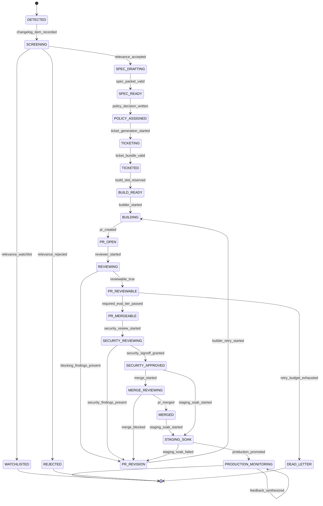

# Factory Control Plane Spec

## Purpose

Turn the strategy document into an implementation-ready control plane for the first factory lane. This spec defines:

- execution lanes and thresholds
- controller responsibilities
- state machine behavior
- the first MVP workflow: `spec -> tickets -> PR -> staging decision -> production monitoring -> feedback synthesis`

## Scope

### In scope

- upstream change detection
- relevance screening
- risk and lane assignment
- ticket generation
- structured eval requirements
- builder and reviewer handoff
- security-reviewed PR output
- staging soak and promotion decisions
- production monitoring records and incident handling
- feedback synthesis artifacts and incident learning capture

### Out of scope for the first executable MVP

- live rollback

Live rollback remains part of the target architecture, but the current build now includes automatic merge orchestration alongside recurring Stage 1 automation, immediate incident feedback handoff, and Stage 9 automation.

## Control Plane Components

### `Factory Controller`

Owns the workflow runtime:

- receives events
- creates work items
- enforces ordering
- tracks state
- retries failed activities
- moves stuck work to dead-letter
- emits audit logs and SLO metrics

### `Policy Engine`

Owns change governance:

- relevance decision
- risk scoring
- lane assignment
- required eval tiers
- approval rules
- rollback class

### `Budget Guardian`

Owns cost and throughput guardrails:

- per-work-item token budget
- per-PR CI budget
- per-week vendor spend ceiling
- concurrency limits per lane

### `Automation Coordinator`

Owns the first recurring loops around the control plane:

- persists Stage 1 through Stage 9 result bundles into a run store
- persists merge-stage result bundles into the same run store
- deduplicates already-seen upstream items
- triggers immediate per-work-item handoff when newly persisted active-build bundles can advance autonomously
- triggers immediate Stage 9 feedback synthesis when Stage 8 monitoring surfaces a live or still-open production incident
- advances active-build runs through autonomous Stages 2 through 8 plus merge orchestration until they hit a human gate or production monitoring
- runs scheduled Stage 1 scout/intake cycles
- runs scheduled weekly Stage 9 feedback cycles for active production runs
- uses renewable per-run leases so concurrent workers skip locked work instead of double-advancing it
- protects `automation-state.json` with a renewable state lease plus compare-and-swap save checks
- can execute a unified supervisor cycle that runs Stage 1 intake, progression, and optional weekly feedback in one control-plane pass

## Work Item Model

Every upstream feature becomes a single `work_item` tracked by the controller.

Persisted fields:

- `work_item_id`
- `source_provider`
- `source_external_id`
- `title`
- `state`
- `risk_score`
- `execution_lane`
- `policy_decision_id`
- `current_artifact_id`
- `attempt_count`
- `dead_letter_reason`
- `created_at`
- `updated_at`

Some fields are nullable until later states. The machine-readable contract lives in [work-item.schema.json](/Users/ian/auto-mindsdb-eng/schemas/work-item.schema.json).

## Risk Lane Matrix

The source of truth is [factory/policies/lanes.yaml](/Users/ian/auto-mindsdb-eng/factory/policies/lanes.yaml). This is the human-readable summary.

| Lane | Score Band | Typical Changes | Merge Policy | Deploy Policy | Release Strategy |
|---|---:|---|---|---|---|
| `fast` | `0-29` | internal tools, docs, reversible low-risk changes | autonomous | autonomous | short soak or shadow |
| `guarded` | `30-69` | user-visible behavior, model routing, cost-sensitive changes | autonomous after gated evals | human-on-exception | canary + sample threshold |
| `restricted` | `70-100` or hard override | auth, permissions, billing, sensitive data, irreversible migrations | human required | human required | staged rollout with explicit sign-off |

### Approval semantics

Lane policies distinguish between:

- `default_required_approvals`
  Approvals that must always be present for the lane.
- `exception_approvals`
  Approvals required only when a threshold breach, waiver, or manual override occurs.

This avoids the ambiguity of treating `guarded` changes as both autonomous and always-human-approved.

## Risk Scoring Rules

### Weighted factors

The initial scoring model is additive:

- `user_visible`: `+15`
- `model_behavior_change`: `+20`
- `external_api_contract_change`: `+15`
- `new_tool_permission`: `+20`
- `billing_impact`: `+25`
- `estimated_monthly_cost_delta_gt_1000_usd`: `+15`
- `low_test_coverage_area`: `+10`
- `rollback_complexity_medium`: `+10`
- `rollback_complexity_high`: `+20`
- `auth_or_permissions`: `+35`
- `sensitive_data_access`: `+35`
- `irreversible_migration`: `+40`

### Hard overrides

The following always force the listed lane regardless of score:

- `restricted`
  - auth or permission changes
  - sensitive data access or persistence
  - irreversible migration
  - production write path without a flag
- `guarded`
  - user-facing LLM output changes
  - high-cost model route changes
  - external contract changes

## Controller State Machine

The controller is event-driven and idempotent. Every state transition must be safe to replay.

## Transition Contract

| From | Event | To | Owner | Artifact Written | Default Retry Policy |
|---|---|---|---|---|---|
| `DETECTED` | `changelog_item_recorded` | `SCREENING` | `Factory Controller` | work item | retry `3` times |
| `SCREENING` | `relevance_accepted` | `SPEC_DRAFTING` | `Policy Engine` | relevance decision | retry `2` times |
| `SPEC_DRAFTING` | `spec_packet_valid` | `SPEC_READY` | `Clarifier` | spec packet | retry `2` times |
| `SPEC_READY` | `policy_decision_written` | `POLICY_ASSIGNED` | `Policy Engine` | policy decision | retry `2` times |
| `POLICY_ASSIGNED` | `ticket_generation_started` | `TICKETING` | `Factory Controller` | none | retry `3` times |
| `TICKETING` | `ticket_bundle_valid` | `TICKETED` | `Ticket Architect` | ticket bundle, eval manifest | retry `2` times |
| `TICKETED` | `build_slot_reserved` | `BUILD_READY` | `Budget Guardian` | budget reservation | retry `3` times |
| `BUILD_READY` | `builder_started` | `BUILDING` | `Builder` | branch metadata | retry `2` times |
| `BUILDING` | `pr_created` | `PR_OPEN` | `Builder` | PR packet draft | retry `1` time |
| `PR_OPEN` | `reviewer_started` | `REVIEWING` | `Reviewer` | review session metadata | retry `2` times |
| `REVIEWING` | `blocking_findings_present` | `PR_REVISION` | `Reviewer` | review findings | retry `0`; hand back to builder |
| `REVIEWING` | `reviewable_true` | `PR_REVIEWABLE` | `Reviewer` | updated PR packet | retry `0` |
| `PR_REVIEWABLE` | `required_eval_tier_passed` | `PR_MERGEABLE` | `Eval Engineer` | eval report | retry `1` time |
| `PR_MERGEABLE` | `security_review_started` | `SECURITY_REVIEWING` | `Security Sentinel` | security review | retry `1` time |
| `SECURITY_REVIEWING` | `security_signoff_granted` | `SECURITY_APPROVED` | `Security Sentinel` | updated security review | retry `0` |
| `SECURITY_REVIEWING` | `security_findings_present` | `PR_REVISION` | `Security Sentinel` | updated security review | retry `0`; hand back to builder |
| `SECURITY_APPROVED` | `merge_started` | `MERGE_REVIEWING` | `Merge Conductor` | merge decision | retry `1` time |
| `MERGE_REVIEWING` | `pr_merged` | `MERGED` | `Merge Conductor` | updated merge decision | retry `0` |
| `MERGE_REVIEWING` | `merge_blocked` | `PR_REVISION` | `Merge Conductor` | updated merge decision | retry `0`; hand back to builder |
| `MERGED` | `staging_soak_started` | `STAGING_SOAK` | `Release Manager` | promotion decision | retry `1` time |
| `SECURITY_APPROVED` | `staging_soak_started` | `STAGING_SOAK` | `Release Manager` | promotion decision | retry `1` time |
| `STAGING_SOAK` | `production_promoted` | `PRODUCTION_MONITORING` | `Release Manager` | updated promotion decision | retry `0` |
| `STAGING_SOAK` | `staging_soak_failed` | `PR_REVISION` | `Release Manager` | updated promotion decision | retry `0`; hand back to builder |
| `PRODUCTION_MONITORING` | `production_health_check_recorded` | `PRODUCTION_MONITORING` | `SRE Sentinel` | monitoring report | continuous |
| `PRODUCTION_MONITORING` | `production_incident_recorded` | `PRODUCTION_MONITORING` | `SRE Sentinel` | monitoring report | continuous |
| `PRODUCTION_MONITORING` | `feedback_synthesized` | `PRODUCTION_MONITORING` | `Feedback Synthesizer` | feedback report | continuous |
| any active state | `retry_budget_exhausted` | `DEAD_LETTER` | `Factory Controller` | dead-letter record | none |

## SLOs

These are initial targets, not promises:

- relevance decision in `4` hours
- spec packet in `8` hours from acceptance
- tickets and eval manifest in `8` hours from spec readiness
- first PR in `24` hours from ticket readiness for `fast` lane
- review loop closure in `12` hours

## Retry And Dead-Letter Policy

### Retry rules

- transport or provider failure: exponential backoff, max `3` retries
- schema validation failure: max `1` retry after self-repair
- policy violation: no retry, send to dead-letter
- token budget exceeded: no retry without controller waiver

### Dead-letter triggers

- repeated schema-invalid outputs
- risk lane mismatch between artifacts
- missing required eval tier
- build loop exceeds max attempts
- upstream provider unavailable beyond SLO

## MVP Workflow: `spec -> tickets -> PR -> staging decision -> production monitoring -> feedback synthesis`

### Step 1: Detect and screen

Input:

- upstream changelog event

Output:

- `spec-packet`
- `policy-decision`

Checks:

- relevance accepted
- score and lane assigned
- spec schema valid

### Step 2: Ticket and eval planning

Input:

- `spec-packet`
- `policy-decision`

Output:

- `ticket-bundle`
- `eval-manifest`

Checks:

- every ticket scoped to `<= 2` days
- every ticket has definition of done
- every ticket lists required eval tiers
- every ticket has rollback strategy

### Step 3: Build and review

Input:

- `ticket-bundle`
- `eval-manifest`

Output:

- `pr-packet`

Checks:

- builder and reviewer use distinct prompt contracts
- static checks pass
- required `pr_smoke` tier passes
- reviewer marks PR as reviewable

### Step 4: Eval, security, and staging decision

Input:

- `pr-packet`
- Stage 4 integration artifacts

Output:

- `eval-report`
- `security-review`
- `promotion-decision`

Checks:

- merge-gating eval tiers pass before security review
- security review blocks or approves with explicit sign-off rules
- staging promotion requires both soak time and request sample thresholds
- promotion only advances to `PRODUCTION_MONITORING` when rollout thresholds hold

### Step 5: Production monitoring

Input:

- `promotion-decision`
- promoted `pr-packet`

Output:

- `monitoring-report`

Checks:

- regressions surface within the four-hour monitoring SLO
- healthy windows keep the work item in `PRODUCTION_MONITORING`
- autonomous rollback or flag disable only happens inside lane policy
- blocked autonomous mitigation escalates to human incident response and feedback capture

### Step 6: Feedback synthesis

Input:

- `monitoring-report`
- monitored `pr-packet`

Output:

- `feedback-report`

Checks:

- incidents become immediate learning packets rather than waiting for a weekly retro
- steady-state windows still emit reusable spec and eval feedback
- synthesized learnings stay linked to Stage 1 inputs and backlog candidates

## MVP Non-Goals

The first working version should not try to do everything:

- no live production deploy orchestration against real infrastructure
- no cross-repo orchestration
- no dynamic provider failover
- no scheduler for fully automated weekly retrospectives

Those can be added after the first lane is stable.

## Recommended Execution Order

1. Validate the handoff schemas in `schemas/`.
2. Implement the controller with the states above.
3. Implement `Scout`, `Clarifier`, and `Policy Engine`.
4. Implement `Ticket Architect` and `Eval Engineer`.
5. Implement `Builder` and `Reviewer` with separate prompt contracts.
6. Add CI to validate `pr_smoke` for the MVP lane.
7. Add the release manager flow for staging soak and promotion decisions.
8. Add the SRE sentinel flow for production monitoring and incident capture.
9. Add the feedback synthesizer flow so production learnings loop back into Stage 1 inputs.

The controller should persist work items using [work-item.schema.json](/Users/ian/auto-mindsdb-eng/schemas/work-item.schema.json).
