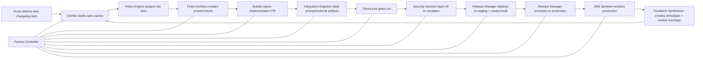

# Agent-First Software Factory Plan

## Goal

Build a nine-stage, event-driven factory that turns external specs into production features with quality, security, and feedback built in. The default mode is **agent-owned execution** with **human-on-exception**, not human-in-the-loop for every step.

## Operating Principles

1. Every stage produces a structured artifact that the next stage can consume immediately.
2. No work begins without explicit acceptance criteria, required evals, and risk classification.
3. Agents can implement, review, test, deploy, monitor, and summarize; humans step in only for policy, security, and exception handling.
4. Merge and release decisions are driven by evals and thresholds, not narrative confidence.
5. Production feedback is treated as first-class input to future specs.
6. Workflows are lane-based: low-risk changes move fast, high-risk changes trigger stricter gates.
7. Every agent action is replayable, idempotent, and attributable to a policy decision.
8. Cost, latency, and safety budgets are enforced as first-class constraints.

## Self-Critique And Tightening

The first draft is directionally right, but too linear and too trusting in a few places. These are the biggest issues to fix:

1. It assumes every changelog item should become work. The factory needs a relevance and ROI filter before ticket generation.
2. It pushes security too late. Risk classification and basic security policy should start at spec time, not just pre-staging.
3. "Full eval suite on every PR" is too expensive and too slow. The system needs tiered evals by risk and change type.
4. A flat 24-hour soak for every feature is the wrong primitive. Promotion should depend on traffic volume and risk, not just time.
5. Weekly feedback is good, but incident learning should be immediate as well as weekly.
6. The plan lacks a control plane for budget, concurrency, policy, and escalation routing.
7. It assumes builder and reviewer are sufficiently independent. In practice, review quality improves when they use different prompts, models, or even providers.

## Design Upgrades

### Add a control plane

Introduce a `Factory Controller` and `Policy Engine` above all stage agents.

- `Factory Controller` owns routing, concurrency, retries, dead-letter handling, and SLA enforcement.
- `Policy Engine` decides the execution lane, required gates, approval rules, and rollback permissions.
- `Budget Guardian` enforces token, compute, and vendor-spend budgets per feature and per week.

Without this layer, the factory is a collection of agents rather than a governed production system.

### Add risk lanes

The same nine stages should execute differently by lane:

- `Fast lane`
  Low-risk internal and reversible changes.
- `Guarded lane`
  User-visible, model-touching, or cost-sensitive changes.
- `Restricted lane`
  Auth, permissions, billing, sensitive data, or irreversible migrations.

The lane is assigned in Stage 1 and can be upgraded later, but never downgraded automatically.

### Pull risk left

Security, compliance, and rollback should start at spec and ticket time, not near release time.

- Every spec packet should include data-classification, blast-radius estimate, and rollback class.
- Every ticket should include allowed tools, secret scope, and deployment constraints.
- High-risk lanes should be blocked from autonomous merge long before staging.

### Split evals by purpose

Use different eval layers instead of one giant suite on every PR:

- `PR smoke`
  Fast unit, contract, and narrow golden-set checks.
- `Pre-merge gate`
  Broader regression, latency, and cost checks.
- `Nightly`
  Full suite, long-running scenarios, adversarial prompts, and cross-model comparisons.
- `Post-deploy canary`
  Shadow traffic, live KPI, and rollback-trigger checks.

This keeps feedback fast without watering down quality.

### Replace time-based soak with evidence-based promotion

Promotion should require both time and sample quality:

- minimum soak duration
- minimum request volume
- no threshold breach
- stable cost profile
- rollback readiness verified

For low-volume features, require synthetic shadow traffic rather than waiting out the clock.

### Make learning immediate

Keep the weekly report, but also create immediate learning loops:

- every incident opens an eval-gap ticket
- every rollback creates a spec correction candidate
- every prompt failure adds to adversarial datasets
- every false-positive alert feeds monitoring calibration

The weekly synthesis then becomes a rollup, not the first time the team learns.

## Default Human Involvement

Humans are replaced where possible, but three checkpoints should remain until the factory has proven itself:

1. Security sign-off for auth, sensitive data, and user-facing LLM features.
2. Production promotion approval for high-risk or customer-visible changes.
3. Policy tuning when the factory changes guardrails, cost thresholds, or escalation rules.

Once the system is stable, even these can move to exception-only for low-risk lanes.

## Core Agents

| Agent | Responsibility | Replaces |
|---|---|---|
| `Scout` | Monitor Anthropic changelog, docs, and release notes | Manual release watching |
| `Clarifier` | Generate and resolve questions, draft spec artifacts | Early PM + staff engineering triage |
| `Spec Librarian` | Store spec, acceptance criteria, assumptions, and open questions | Manual documentation |
| `Ticket Architect` | Split spec into buildable 1-2 day tickets with eval requirements | Senior engineer ticket decomposition |
| `Builder` | Implement code, tests, types, migrations, docs | First implementation pass |
| `Reviewer` | Review PRs against spec, architecture, and edge cases | First-pass code review |
| `Integration Engineer` | Own prompts, tool schemas, context windows, retries, fallbacks | LLM integration engineer |
| `Eval Engineer` | Create and maintain golden sets, regression checks, quality rubrics | Test/eval engineering |
| `Security Sentinel` | Threat-model auth, storage, prompt injection, jailbreak, exfiltration | Security reviewer |
| `Release Manager` | Handle flagging, staging soak, rollout checks, rollback readiness | Release engineer |
| `SRE Sentinel` | Watch prod metrics, alert, rollback, and incident-create | First-line on-call monitoring |
| `Feedback Synthesizer` | Package weekly learnings into spec feedback and improvement tasks | Retrospective + product feedback loop |
| `Factory Controller` | Route work, enforce policy, manage retries, and coordinate stage transitions | Technical program management + workflow control |
| `Policy Engine` | Assign risk lanes, gate approvals, and define autonomy boundaries | Change management and release policy |
| `Budget Guardian` | Enforce spend, latency, and throughput budgets | Engineering management cost control |

## End-to-End Flow



## Stage Plan

### Stage 1 - Anthropic drops a spec

**Owner agent:** `Scout` -> `Clarifier` -> `Spec Librarian` -> `Policy Engine`

**Automation**

- `Scout` polls the Anthropic changelog and release feeds on a schedule.
- On a new item, it opens a `spec packet`.
- `Clarifier` extracts feature intent, product impact, dependencies, unknowns, affected services, and rollout risk.
- `Clarifier` batches questions into:
  - answerable from public docs
  - answerable from internal architecture docs
  - truly blocking unknowns
- `Spec Librarian` writes the result into the internal spec document.
- `Policy Engine` decides whether the item is:
  - ignore
  - watchlist
  - backlog candidate
  - active build candidate
- `Policy Engine` assigns an initial execution lane and risk score.

**Output artifact**

- `spec.md`
- `acceptance_criteria.yaml`
- `open_questions.yaml`
- `risk_profile.yaml`
- `relevance_decision.yaml`
- `execution_lane.yaml`

**Gate to next stage**

- Acceptance criteria are explicit.
- Open questions are either resolved or marked non-blocking.
- Risk tier is assigned.
- The item is explicitly accepted into the build queue.

**Human involvement**

- None by default.
- Escalate only if blocking questions cannot be resolved from available context within 24 hours.

### Stage 2 - Spec to tickets

**Owner agent:** `Ticket Architect` -> `Policy Engine`

**Automation**

- Converts the spec packet into tickets that can be completed in 1-2 days.
- Adds definition of done, dependencies, edge cases, non-goals, and required evals.
- Assigns each ticket a risk level and an execution lane:
  - standard backend/frontend
  - LLM integration
  - security-sensitive
  - infra/release
- Adds budget and concurrency limits to each ticket.
- Tags which eval tier must run at PR, pre-merge, nightly, and post-deploy.

**Output artifact**

- `tickets.json`
- `dependency_graph.json`
- `eval_manifest.yaml`
- `budget_policy.yaml`

**Gate to next stage**

- Every ticket has a test/eval plan.
- No ticket exceeds the 1-2 day scope rule.
- Dependencies and merge order are explicit.
- Every ticket has an assigned lane, budget, and rollback strategy.

**Human involvement**

- Optional only when scope crosses teams or requires a product tradeoff.

### Stage 3 - Agent writes the first draft

**Owner agent:** `Builder` -> `Reviewer`

**Automation**

- `Builder` checks out a branch, scaffolds implementation, adds tests, updates types, and drafts docs.
- `Reviewer` runs immediately after code generation and reviews for:
  - spec compliance
  - architecture fit
  - edge-case coverage
  - migration safety
  - missing tests
- `Reviewer` should use a different prompt template and ideally a different model/provider than `Builder`.
- The builder loops until the PR is reviewable.

**Output artifact**

- Pull request
- `pr_packet.md`
- test files
- migration notes if needed

**Gate to next stage**

- Static checks pass.
- PR references the ticket, spec, and eval manifest.
- Reviewer finds no unresolved blocking issue.
- Builder loop count and token budget remain within policy.

**Human involvement**

- Replace human implementation entirely for low-risk tickets.
- Add human review only for high-risk code paths or foundational architecture changes.

### Stage 4 - AI integration layer wires it up

**Owner agent:** `Integration Engineer`

**Automation**

- Defines prompts, tool schemas, context assembly, model routing, retry logic, fallback behavior, and output validation.
- Builds the golden dataset before release.
- Records baseline latency, token usage, and expected quality scores.
- Adds failure injection tests for bad tool outputs, prompt injection attempts, and degraded model responses.

**Output artifact**

- `prompt_contract.yaml`
- `tool_schema.json`
- `golden_dataset.jsonl`
- `latency_baseline.json`

**Gate to next stage**

- Every model-touching change has eval coverage.
- Prompt and tool contracts are versioned.
- Failure and retry modes are explicit.

**Human involvement**

- None for established patterns.
- Optional review for novel prompt architectures or safety-sensitive flows.

### Stage 5 - Evals run on every PR

**Owner agent:** `Eval Engineer`

**Automation**

- CI runs the eval tier required by ticket policy:
  - PR smoke tests
  - integration and contract tests
  - narrow LLM quality evals
  - targeted regression against golden datasets
- Pre-merge or nightly runs:
  - broader regression suites
  - latency benchmarks
  - cost-per-call checks
  - adversarial prompt suites
  - cross-model comparisons where applicable
- `Eval Engineer` auto-triages failures and posts a diagnosis to the PR.

**Output artifact**

- CI status
- `eval_report.json`
- `regression_summary.md`
- `cost_report.json`

**Gate to next stage**

- No red checks.
- No quality, latency, or cost regression beyond threshold.
- Any waived failure requires policy-tagged approval.
- Required eval tier for the ticket is complete.

**Human involvement**

- None for the default merge decision.
- Humans only review if a waiver is requested.

### Stage 6 - Security review

**Owner agent:** `Security Sentinel`

**Automation**

- Re-validates the risk lane assigned earlier in the pipeline.
- Runs threat modeling for:
  - auth and authorization
  - secrets handling
  - stored user data
  - prompt injection
  - context exfiltration
  - jailbreak risk
  - unsafe tool invocation
- Generates abuse cases and security tests.
- Signs off automatically for low-risk changes that match approved patterns.
- Verifies agent tool permissions match least-privilege policy.

**Output artifact**

- `threat_model.md`
- `security_checks.json`
- `signoff.json`

**Gate to next stage**

- No unmitigated critical or high findings.
- Required security tests exist and pass.
- Rollback and blast radius are documented.

**Human involvement**

- Required for high-risk categories until enough confidence is built.
- Eventually can become exception-only for pre-approved low-risk patterns.

### Stage 7 - 24-hour staging soak to production

**Owner agent:** `Release Manager`

**Automation**

- Deploys behind a feature flag.
- Enables staging traffic, shadow traffic, or canary traffic based on lane.
- Monitors:
  - error rate
  - latency
  - cost
  - model failure modes
  - business KPI proxies
- Verifies rollback plan before promotion.
- Promotes automatically only if thresholds hold for both the soak window and the minimum sample-size requirement.

**Output artifact**

- `release_runbook.md`
- `staging_report.json`
- `rollback_plan.md`
- `promotion_decision.json`

**Gate to next stage**

- Minimum soak and sample-size thresholds completed.
- No threshold breach.
- Rollback path tested.

**Human involvement**

- Optional for low-risk releases.
- Required for high-risk production promotions during early rollout.

### Stage 8 - Production monitoring

**Owner agent:** `SRE Sentinel`

**Automation**

- Watches dashboards and alert policies continuously.
- Detects regressions within 4 hours across:
  - quality
  - latency
  - error rate
  - cost-per-call
  - fallback frequency
- Creates incident tickets automatically.
- Can auto-disable a feature flag or rollback within pre-approved policies.
- Can trigger immediate kill-switch behavior for severe safety or security anomalies.

**Output artifact**

- live alerts
- incident packets
- rollback actions

**Gate to next stage**

- Continuous; no terminal gate.

**Human involvement**

- Humans are paged only after automated mitigation fails or policy blocks autonomous rollback.

### Stage 9 - Weekly feedback

**Owner agent:** `Feedback Synthesizer`

**Automation**

- Captures event-driven learning packets immediately after incidents, rollbacks, or major eval misses.
- Packages:
  - production incidents
  - unexpected user behavior
  - spec mistakes
  - eval misses
  - positive surprises
- Converts those into:
  - spec corrections
  - eval improvements
  - guardrail changes
  - new backlog items

**Output artifact**

- `weekly_factory_report.md`
- `spec_feedback.md`
- `incident_learning_packets/`
- new tickets

**Gate to next stage**

- The report is published weekly and linked back into Stage 1 inputs.

**Human involvement**

- Optional review by a lead, but not required for the loop to continue.

## Handoff Contract

To keep stage transitions immediate, every stage must write structured outputs to a shared artifact store. Recommended minimum contract:

```text
factory/
  specs/
  tickets/
  prs/
  prompts/
  evals/
  security/
  releases/
  incidents/
  feedback/
```

Each artifact should include:

- `id`
- `version`
- `source_stage`
- `next_stage`
- `status`
- `risk_tier`
- `execution_lane`
- `owner_agent`
- `policy_decision_id`
- `model_fingerprint`
- `budget_class`
- `blocking_issues`
- `links`
- `rollback_class`
- `approval_requirements`
- `created_at`
- `updated_at`

The next stage is triggered automatically when:

1. status is `ready`
2. required artifacts exist
3. gating checks pass
4. policy and budget checks pass

## Recommended Technical Architecture

### 1. Workflow orchestrator

Use a durable workflow engine so each stage is resumable and auditable.

- Best fit: Temporal
- Simpler MVP: GitHub Actions + queue + webhook workers

### 2. Agent runtime

Use specialized agents with explicit tool permissions instead of one generalist agent. Each agent should have:

- a narrow prompt
- a bounded toolset
- a structured output schema
- a timeout and retry policy
- an isolated workspace or sandbox
- an idempotent resume contract
- explicit model/provider diversity where review independence matters

### 3. Artifact store

Store stage outputs in a versioned system:

- Git repo for code-facing artifacts
- docs database or object store for larger reports
- issue tracker for ticket state

### 4. Execution surfaces

- GitHub for PRs, checks, merges
- Linear/Jira/GitHub Issues for tickets
- Feature flag platform for staged rollout
- CI runners for eval and test execution
- Observability stack for latency, errors, cost, and quality

### 5. Observability

Track at least:

- PR lead time
- ticket cycle time
- eval pass rate
- regression rate
- budget burn per feature
- autonomous-success rate by lane
- human override rate
- security findings per release
- staging soak failures
- prod rollback frequency
- time-to-detect
- time-to-mitigate
- weekly feedback themes

## Minimal Human Team

If you want "AI all the way down," the smallest human structure I would keep is:

1. `Factory Owner`
   Maintains policies, approves major guardrail changes, and reviews weekly output.
2. `Security Approver`
   Signs off only on high-risk releases and new threat classes.
3. `Ops Escalation`
   Acts only when rollback or auto-mitigation fails.

Everyone else can be agents in the target design.

## Suggested Approval Policy

### Fully autonomous lanes

- internal tools
- non-sensitive CRUD
- docs and SDK updates
- low-risk UI features
- prompt iterations behind flags with existing eval coverage

### Human-on-exception lanes

- user-facing LLM features
- billing-affecting logic
- auth or permissions
- sensitive data access
- irreversible migrations
- high-cost inference changes

## Additional Tightening Recommendations

1. Add a `Definition of Relevance` before Stage 1 can enqueue work.
   Otherwise the factory will chase every upstream announcement and create expensive noise.
2. Introduce per-stage SLOs.
   Example: spec packet in 4 hours, ticket set in 8 hours, first PR in 24 hours for fast-lane changes.
3. Add dead-letter queues and operator dashboards.
   A factory fails differently from an app; stuck workflows and retry storms need first-class visibility.
4. Require deterministic schemas for every agent handoff.
   Free-form markdown is useful for people, but machine handoff should be JSON or YAML with validation.
5. Separate "reviewable PR" from "mergeable PR."
   The plan currently blurs those states; they should be distinct milestones with different gates.
6. Add a dataset and prompt versioning strategy.
   Otherwise rollback of LLM behavior will be weaker than rollback of code.
7. Add provider-failure and degraded-mode plans.
   If Anthropic rate limits or degrades, the factory should know whether to queue, fail over, or pause.
8. Measure autonomy honestly.
   Track how often agents succeed without intervention, where humans override them, and which stage creates rework.

## Remaining Open Risks

These are still unresolved design questions, not oversights:

1. Dataset bootstrapping
   The factory assumes golden datasets exist, but early products often need humans or carefully curated synthetic data to start them.
2. Migration safety
   Irreversible database and data-shape changes need a stricter forward/backward compatibility playbook than normal code rollout.
3. Multi-repo coordination
   If one upstream feature spans SDK, backend, and product surfaces, the controller needs cross-repo orchestration rather than single-repo PR logic.
4. Staging realism
   Shadow and canary strategies are only useful if the staging inputs are representative and privacy-safe.
5. Success metrics
   The factory should optimize for adoption or business impact, not just cycle time and regression avoidance.

## MVP Rollout Plan

### Phase 1 - Spec to PR

Ship Stages 1-3 first:

- changelog monitor
- spec packet generation
- ticket generation
- builder + reviewer PR flow

**Success metric:** reviewable PR in under 48 hours from new spec detection.

### Phase 2 - Eval and security gate

Ship Stages 4-6 next:

- prompt contracts
- golden dataset support
- CI eval gating
- security threat modeling and sign-off

**Success metric:** no merge without passing eval and security policy.

### Phase 3 - Release and monitoring

Ship Stages 7-9 last:

- feature-flag deployment
- 24-hour soak automation
- production alerting
- weekly synthesis loop

**Success metric:** regression detection within 4 hours and weekly feedback automatically generated.

## What I Would Build First

If starting today, I would implement these components in order:

1. `factory-controller + policy engine`
2. `spec-packet schema + relevance gate`
3. `ticket-generator + lane assignment`
4. `builder/reviewer PR worker with model diversity`
5. `tiered eval manifest + CI gate`
6. `security sentinel + least-privilege checks`
7. `release manager + canary/soak policy`
8. `feedback synthesizer + incident learning loop`

## Implementation Artifacts

The strategy document now has concrete follow-on artifacts:

- control plane spec: `docs/factory-control-plane-spec.md`
- lane policy: `factory/policies/lanes.yaml`
- eval tier policy: `factory/policies/eval-tiers.yaml`
- handoff schemas:
  - `schemas/work-item.schema.json`
  - `schemas/spec-packet.schema.json`
  - `schemas/policy-decision.schema.json`
  - `schemas/ticket-bundle.schema.json`
  - `schemas/eval-manifest.schema.json`
  - `schemas/pr-packet.schema.json`

## Recommended Default Policy

Use this operating policy on day one:

- agents execute by default
- humans approve only on risk
- no merge without evals
- no production without soak
- no LLM feature without golden set
- no incident without feedback capture

That gets you very close to "AI all the way down" without pretending the risky parts are solved by optimism alone.
